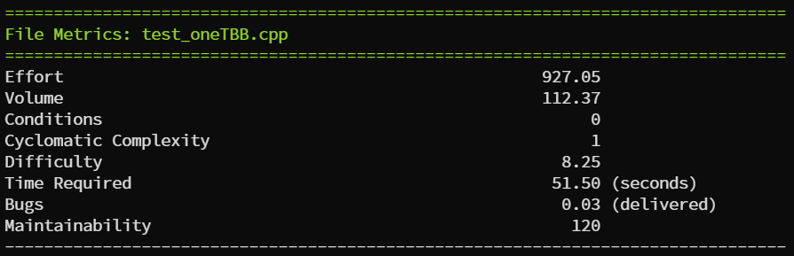
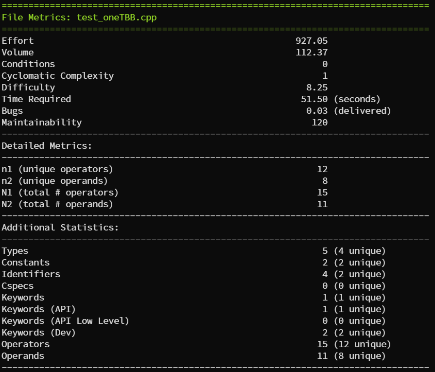
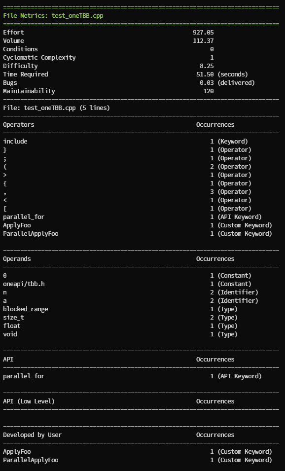

# c3ms: Halstead's Effort and Complexity Metrics Calculator

**c3ms** is a comprehensive tool for calculating Halstead's programming effort and various complexity metrics. It analyzes the token composition in code files, providing valuable insights into your software's complexity and maintainability.

## Table of Contents

- [Installation](#installation)
  - [Debug/Development Mode](#debugdevelopment-mode)
  - [Release Mode](#release-mode)
- [Usage](#usage)
- [Description](#description)
- [Options](#options)
- [Usage Guide](#usage-guide)
- [Updates and Contributions](#updates-and-contributions)
- [FAQs/Troubleshooting](#faqstroubleshooting)
- [License](#license)
- [Acknowledgments](#acknowledgments)

## Installation

**Prerequisites**: Ensure that your system meets the required dependencies before installation. 

### Debug/Development Mode

For developers and contributors:

```shell
./configure --with-debug
make
```

### Release Mode

For standard installation:

```shell
./configure
make
```

## Usage

To get started:

```shell
./C3MS [-h] [-f] [-a] [-g] [-v level] <files>
```

Detailed examples and use cases are available in the [Usage Guide](#usage-guide).

## Description

`c3ms` independently calculates metrics for each file and aggregates them across all files, offering a comprehensive analysis of programming effort and complexity.

### Criteria for Tokens

- **Operands**: Constants, types, identifiers, and C specifiers.
- **Operators**: Language and API keywords, custom developer keywords.

Includes Halstead's volume, conditional statement counts, and more.

## Options

Comprehensive command options with different levels of verbosity are available, catering to various analysis needs.

- `h`, `--help`:
  - **Function:** Displays a comprehensive help message.

- `f`, `--function-metrics`:
  - **Function:** Initiates an in-depth analysis and generates a report detailing metrics for each individual function within the source files.
  - **Use Case:** Use this when you need a granular view of each function's complexity and performance metrics.

- `a`, `--file-metrics`:
  - **Function:** Focuses the analysis at the file level, providing a metrics report for each file.
  - **Use Case:** Beneficial when evaluating the overall quality or complexity of each file independently.

- `g`, `--global-metrics`:
  - **Function:** Aggregates and reports metrics across all specified files, offering a holistic view of the entire codebase.
  - **Use Case:** Ideal for getting an overall sense of the project's complexity and maintainability.

- `-v [level]`, `--verbosity [level]`:
  - **Function:** Controls the depth of information included in the output.
  - **Levels:**
    - **Level 1:** Basic metrics, providing an overview of essential aspects like Effort, Volume, Conditions, Cyclomatic Complexity, Difficulty, Time Required, Bugs, and Maintainability.
    - **Level 2:** Includes everything in Level 1, plus additional statistical data such as Types, Constants, Identifiers, C Specifiers, Keywords, and Operators.
    - **Level 3:** Encompasses all metrics from Levels 1 and 2, supplemented with Detailed Metrics for a comprehensive analysis. This includes unique operators (n1), unique operands (n2), total operators (N1), and total operands (N2).
  - **Use Case:** Adjust the verbosity level based on your reporting needs – whether you require a high-level summary (Level 1), more detailed insights (Level 2), or an exhaustive analysis (Level 3).

These command options empower users to fine-tune the analysis process, ensuring that c3ms delivers precisely the insights needed, whether for a quick overview or a detailed examination of your code's complexity and maintainability.

## Usage Guide

### Basic Usage

```shell
./C3MS -a <files>
```



### Verbose Mode

```shell
./C3MS -a -v 3 <files>
```



### Debug mode (for developers)

In this mode, the tool will display the tokens found in the file, along with their corresponding type. To analyze a single file in debug mode:

```shell
./configure --with-debug
make
./C3MS -a <files>
```



## Updates and Contributions

### By C. Campos-Ferrer (University of Málaga)

- Extensive project restructuring and lexicon expansion.
- Enhanced parsing capabilities and introduction of new metrics.
- Overall improvement in performance and usability.

Full details of the 2023 updates can be found [here](https://github.com/cricamfe/c3ms/releases).

## FAQs/Troubleshooting

For common questions and troubleshooting advice, visit our [FAQs section](#faqstroubleshooting).

## License

This project is licensed under GPL-2.0 license. See the [LICENSE file](LICENSE) for details.

## Acknowledgments

- Special thanks to all contributors and to **Basilio B. Fraguela** for the original code (2009-2010).

- This project utilizes the [template](https://github.com/remusao/Bison-Flex-CPP-template) by ***remusao***.
